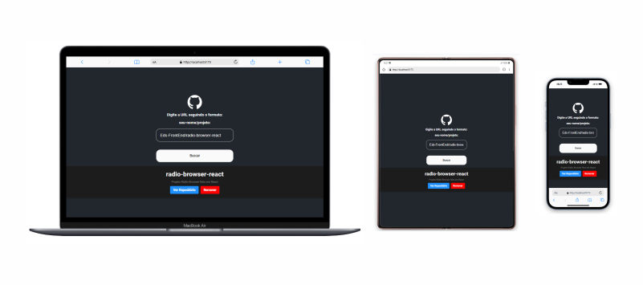

# ⚡ Projeto - GitFind REACT

## 🚀 Bem-vindo ao projeto GitFind!

Este projeto foi desenvolvido com:

- **🌐 React**
- **🎨 Styled-Components**

## Instruções para rodar o projeto

Antes de começar, certifique-se de ter o **Node.js** e o **npm** instalados em seu ambiente de desenvolvimento.

- **Node.js**: [Baixar Node.js](https://nodejs.org/)
- **npm** (gerenciador de pacotes do Node.js): Geralmente instalado junto com o Node.js

### 1. Baixar ou clonar o projeto

Baixe ou clone o repositório do GitHub. Depois, navegue até a pasta do projeto:

```bash
cd gitfind-main
```

### 2. Instalar as dependências
Instale as dependências necessárias do projeto utilizando o npm:

```bash
npm install
```

### 3. Instalar as bibliotecas Styled-components e Axios
Instale as dependências necessárias do projeto utilizando o npm:

```bash
npm install styled-components axios
```

### 4. Iniciar o servidor de desenvolvimento
Após a instalação das dependências, execute o comando abaixo para iniciar o servidor de desenvolvimento:

```bash
npm run dev
```
Isso vai iniciar o projeto, e você poderá acessá-lo no navegador, geralmente em http://localhost:3000 (ou outra porta, caso configurada).

## Mais Detalhes sobre o Projeto
####  A tipagem dos dados foi realizada utilizando a extensão .tsx (TypeScript com React).
Este projeto é totalmente responsivo, adaptando-se a diferentes tamanhos de tela e dispositivos.


